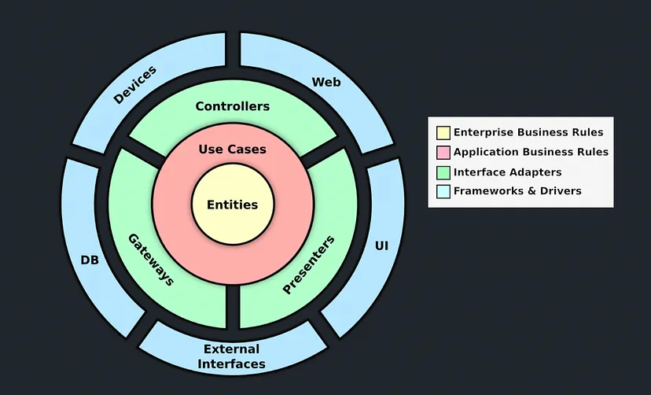
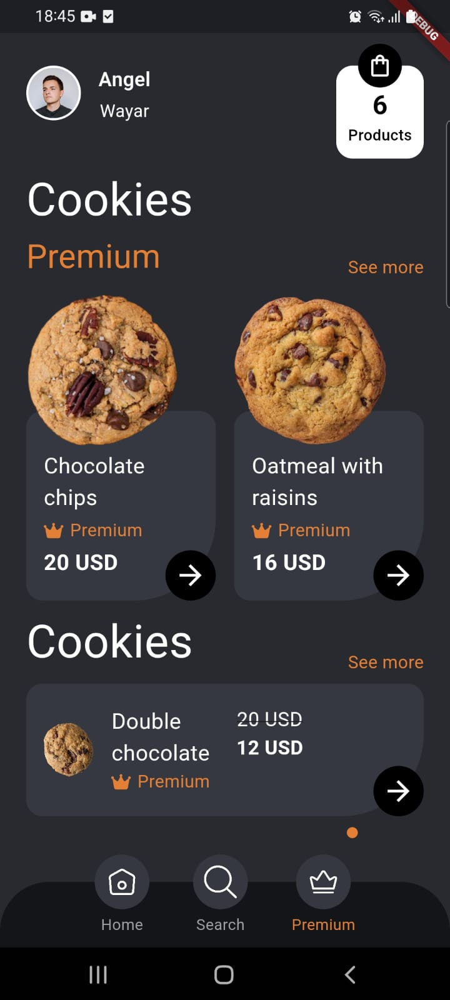
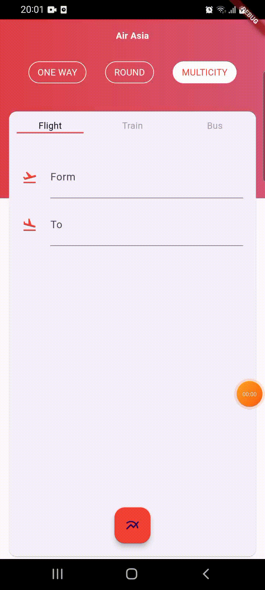
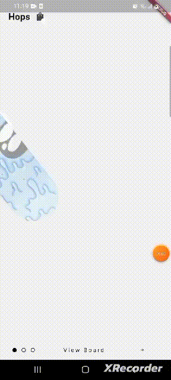
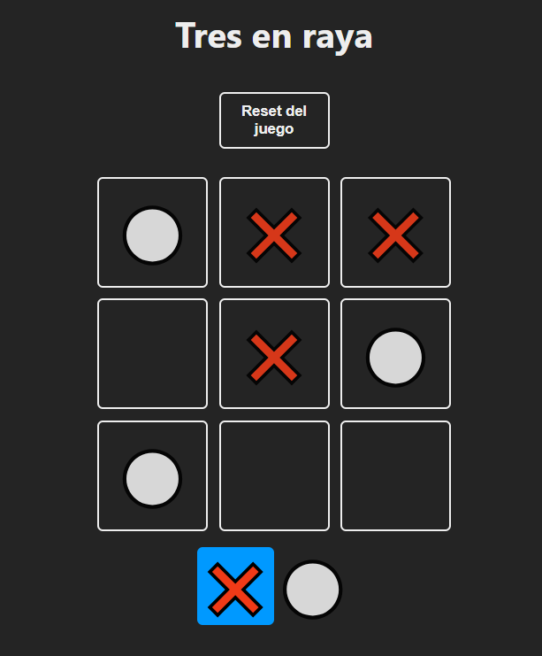
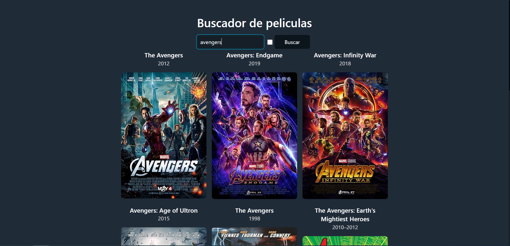

### Hi there 👋
### I'm Angel Wayar, full-stack developer 

- 🔭 I’m currently working on [Ml-Plataform](https://github.com/angelwayar/ml-plataform), [Ml-Plataform-Front-End](https://github.com/angelwayar/ml-plataform-f) 

- 🌱 I’m currently learning about machine learning

## My Skill Set  
<table><tr><td valign="top" width="33%">

### Frontend  

  
  
  
  
  
  
  
  

  

</td><td valign="top" width="33%">

### Backend  

  
  
  
  
  
  
  

  
  
  
  

</td></table>

   

## My work
### Flutter
| [Fipod](https://github.com/angelwayar/fipod)     | [Animated_SideBar](https://github.com/angelwayar/animated_sidebar) |
| ----------- | ----------- |
|     |        |
| [Clean Architecture For Flutter](https://github.com/angelwayar/clean-architecture)     | [Cookies App](https://github.com/angelwayar/cookies_app) |
|     |        |
| [Flight App](https://github.com/angelwayar/flight_app)     | [Skateboard Onboarding App](https://github.com/angelwayar/skateboard_app) |
|     |        |

### React
| [Tres En Raya](https://github.com/angelwayar/tres_en_raya)    | [Buscador De Películas](https://github.com/angelwayar/search_movies)     |
| ----------- | ----------- |
|     |     |

## Connect with me  

  

  
  

   

## Github Stats  

  

   
